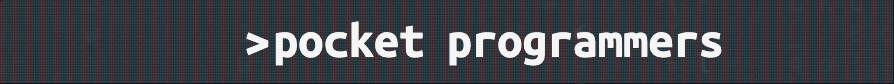

# 

A digital trading card experience themed around software engineers where users can open packs, unlock cards, and trade with other users 

* Collect 1200+ unique variations of cards
* Generate randomly generated assortments of cards upon pack open
* Track cards transaction history 
* Visualize market data associated with cards

**Try it out here:** [Pocket Programmers](https://pocketprogrammers.herokuapp.com/)

# Demos:


#
## Technical Accomplishments

* Created a backend database used to generate 1200+ possible unique card variations.
* Utilized knowledge of probability theory to build customizable probability distributions for card variations and rarities.
* Developed a peer to peer user marketplace where users can exchange cards directly with other users.
* Implemented data visualization modules to offer easy to understand market information on card value. 

**Made With:** 

<a href="https://developer.mozilla.org/en-US/docs/Web/JavaScript" target="_blank" rel="noreferrer">  </a> 
  <a href="https://reactjs.org/" target="_blank" rel="noreferrer">  </a> 
  <a href="https://www.ruby-lang.org/en/" target="_blank" rel="noreferrer">  </a>
   <a href="https://rubyonrails.org" target="_blank" rel="noreferrer">  </a> 
    <a href="https://www.postgresql.org" target="_blank" rel="noreferrer">  </a>

</p>

#
## How to Run This Application:
* Install Ruby Gems with via the "Bundle Install" command
* Install required NPM nodes with the command "npm install --prefix client"
* Run the following commands in two seperate terminals:

```
// start the server
rails s 
```

```
// start the frontend interface
npm start --prefix client 
```


